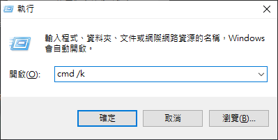

# novel-opds-now

   按需生成 epub，此模組不使用排程任務來生成 epub

> 按需生成 epub，此模組不使用排程任務來生成 epub<br/>
> 所有 epub 只在請求時才會打包<br/>
> 並且如果發現有緩存的話，則會直接使用緩存<br/>
> 而不會再打包一次，同一個檔案在 24 小時內只會更新一次<br/>
> 使用了 [gun](https://github.com/amark/gun) 模組來進行緩存

## install

請記得先安裝 [Node.js](https://nodejs.org/zh-tw/)

接著如果是 windows 系統 可以利用 win + R 然後輸入 cmd /k



接著在終端機裡面輸入以下指令

### npm 安裝/更新

> 此指令僅需於安裝或者更新時才輸入

```
npm install -g novel-opds-now
```

> 啟動伺服器，此指令每次要啟動伺服器時都要輸入

```
novel-opds-now -p 3000
```

### npx 安裝/啟動

**( 不推薦使用 npx 來進行安裝，但如果有奇奇怪怪的狀況可以嘗試看看 )**

```
npx novel-opds-now
```


