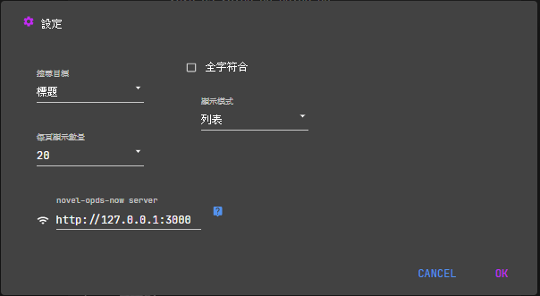

# novel-opds-now

   按需生成 epub，此模組不使用排程任務來生成 epub

> 按需生成 epub，此模組不使用排程任務來生成 epub<br/>
> 所有 epub 只在請求時才會打包<br/>
> 並且如果發現有緩存的話，則會直接使用緩存<br/>
> 而不會再打包一次，同一個檔案在 24 小時內只會更新一次<br/>
> 使用了 [IPFS](https://js.ipfs.io/zh-CN/) 模組來進行緩存

## install

請記得先安裝 [Node.js](https://nodejs.org/zh-tw/) 推薦安裝最新版

接著如果是 windows 系統 可以利用 win + R 然後輸入 cmd /k


接著在終端機裡面輸入以下指令

### npm 安裝/更新

> 此指令僅需於安裝或者更新時才輸入

```
npm install --force -g novel-opds-now
```

> 啟動伺服器，此指令每次要啟動伺服器時都要輸入(以下兩個指令隨便選一個)

```
novel-opds-now -p 3000
npx novel-opds-now -p 3000
```

> 使用 Proxy 的情況下

```
novel-opds-now -p 3000 --proxy http://xxx.xxx.xxx.xxx:xxxx
```

或者設定環境參數 `HTTP_PROXY`

### npx 安裝/啟動

**( 不推薦使用 npx 來進行安裝，但如果有奇奇怪怪的狀況可以嘗試看看 )**

```
npx novel-opds-now
```

## FAQ

1. 安裝成功，但啟動伺服器時出現 `'novel-opds-now' 不是內部或外部命令、可執行的程式或批次檔。` 訊息的話，請改用 `npx novel-opds-now` 指令來啟動伺服器

2. 當手機與電腦不同網路環境下，請利用 https://www.npmjs.com/package/share-localhost 這類工具來讓試著連接伺服器

3. 安裝時出現 assemblyscript 安裝失敗，請安裝 [git](https://gitforwindows.org/)

4. 如果是大陸GFW牆內使用者 請依照此篇 來做設定 https://segmentfault.com/a/1190000004444283

---



